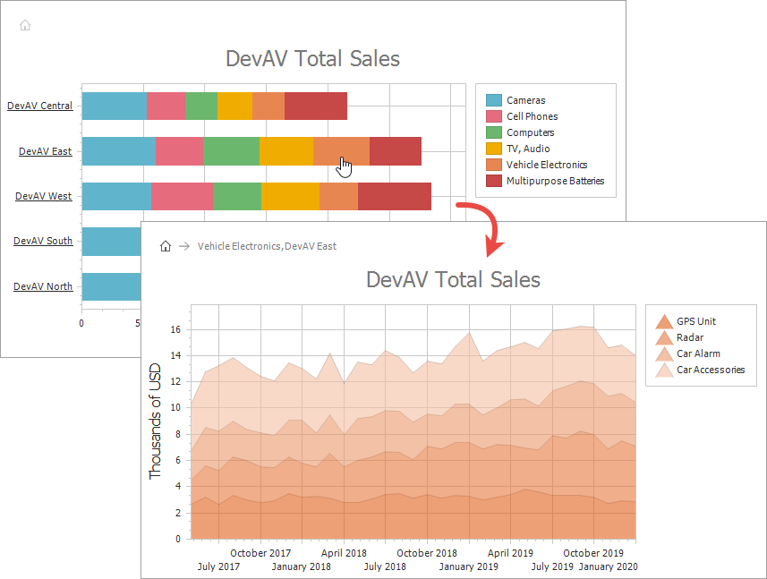

# How to: Create a Drill-Down Chart

This example demonstrates how to display master-detail data in the same chart.

You can only use the Drill-Down functionality when [chart series](https://docs.devexpress.com/AspNet/15966/aspnet-webforms-controls/chart-control/concepts/chart-elements/series) are generated by [series templates](https://docs.devexpress.com/AspNet/15950/aspnet-webforms-controls/chart-control/concepts/creating-charts/providing-data/automatic-series-creation).

* Use [SeriesTemplate.ArgumentDrillTemplate](https://docs.devexpress.com/CoreLibraries/DevExpress.XtraCharts.SeriesTemplate.ArgumentDrillTemplate) to specify detail data when a user clicks an argument's [axis label](https://docs.devexpress.com/AspNet/15988/aspnet-webforms-controls/chart-control/concepts/chart-elements/axes/axis-labels).

* Use [SeriesTemplate.SeriesDrillTemplate](https://docs.devexpress.com/CoreLibraries/DevExpress.XtraCharts.SeriesTemplate.SeriesDrillTemplate) to specify how the Chart Control displays detail data when a user clicks a [series](https://docs.devexpress.com/AspNet/15966/aspnet-webforms-controls/chart-control/concepts/chart-elements/series) (or the series's marker in a [legend](https://docs.devexpress.com/AspNet/15997/aspnet-webforms-controls/chart-control/concepts/chart-elements/legend)). 

* Use [SeriesTemplate.SeriesPointDrillTemplate](https://docs.devexpress.com/CoreLibraries/DevExpress.XtraCharts.SeriesTemplate.SeriesPointDrillTemplate) to specify detail data when a user clicks a [series point](https://docs.devexpress.com/WindowsForms/6168/controls-and-libraries/chart-control/fundamentals/chart-elements/series/series-points).