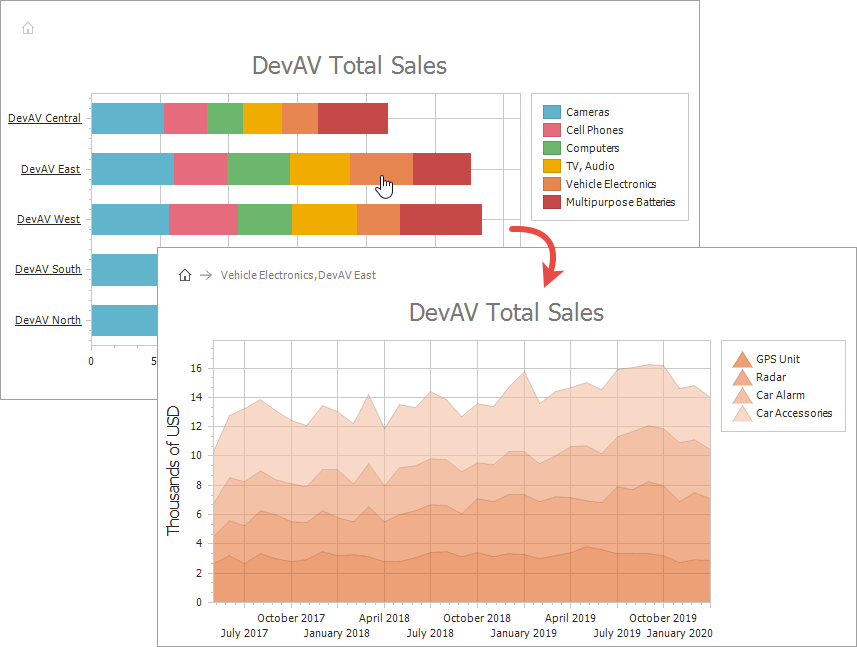

# ASP.NET Web Forms Chart Control - Create a Drill-Down Chart

This example demonstrates how to create a drill-down chart to display master-detail data.

To implement drill-down functionality, generate [chart series](https://docs.devexpress.com/AspNet/15966/components/chart-control/concepts/chart-elements/series) using [series templates](https://docs.devexpress.com/AspNet/15950/aspnet-webforms-controls/chart-control/concepts/creating-charts/providing-data/automatic-series-creation):

* Use [SeriesTemplate.ArgumentDrillTemplate](https://docs.devexpress.com/CoreLibraries/DevExpress.XtraCharts.SeriesTemplate.ArgumentDrillTemplate) to specify detail data when a user clicks an argument [axis label](https://docs.devexpress.com/AspNet/15988/aspnet-webforms-controls/chart-control/concepts/chart-elements/axes/axis-labels).

* Use [SeriesTemplate.SeriesDrillTemplate](https://docs.devexpress.com/CoreLibraries/DevExpress.XtraCharts.SeriesTemplate.SeriesDrillTemplate) to specify how the Chart control displays detail data when a user clicks a [series](https://docs.devexpress.com/AspNet/15966/aspnet-webforms-controls/chart-control/concepts/chart-elements/series) (or a series marker in the [legend](https://docs.devexpress.com/AspNet/15997/aspnet-webforms-controls/chart-control/concepts/chart-elements/legend)). 
* Use [SeriesTemplate.SeriesPointDrillTemplate](https://docs.devexpress.com/CoreLibraries/DevExpress.XtraCharts.SeriesTemplate.SeriesPointDrillTemplate) to specify detail data when a user clicks a [series point](https://docs.devexpress.com/WindowsForms/6168/controls-and-libraries/chart-control/fundamentals/chart-elements/series/series-points).

<!-- feedback -->
## Does this example address your development requirements/objectives?

 

(you will be redirected to DevExpress.com to submit your response)
<!-- feedback end -->
